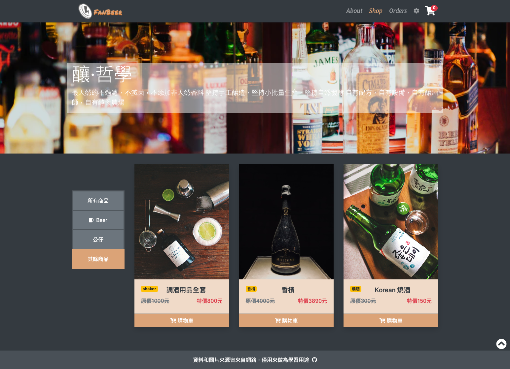
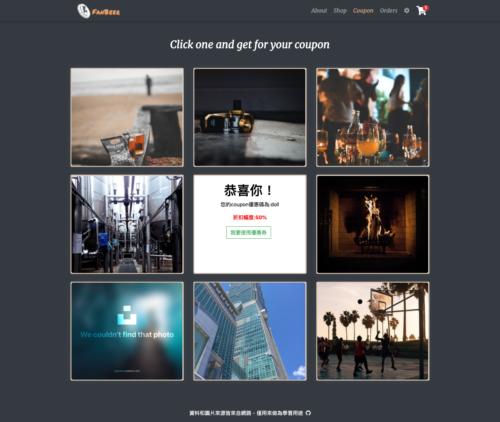
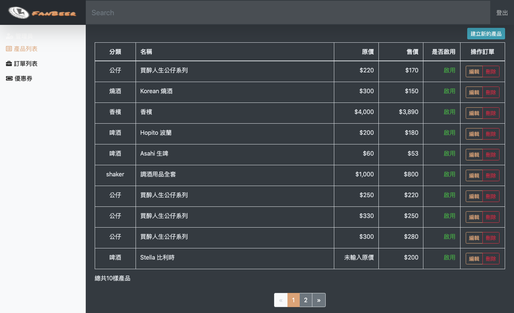

# Beer store

使用 Vue CLI3 及 Vue Router 完成 SPA 互動式電商網站，涵蓋前後台，串接 API 實做出商品管理 (CRUD)、購物車、優惠券、登入/登出介面等功能，並搭配 ESLint Airbnb維持程式碼品質.

## Demo

https://fan630.github.io/beerstore/#/

## 前台

### 商品頁面

### 優惠券卡片翻排
點選優惠券後會自動套用

## 後台

### 使用技術

- Vue Cli 3
- VueRouter
- ESlint 的 Airbnb 優化程式碼
- RWD 響應式網頁設計
- Bootstrap4
- SCSS
- TinyPNG (縮小圖檔)
- API串接 (由六角學院提供)

### 使用插件

- Vee-validate
- Vue-axios
- Vue-loading-overlay
- Vue-router
- vue-awesome-swiper
- fontawesome
- AOS
- amimate.css